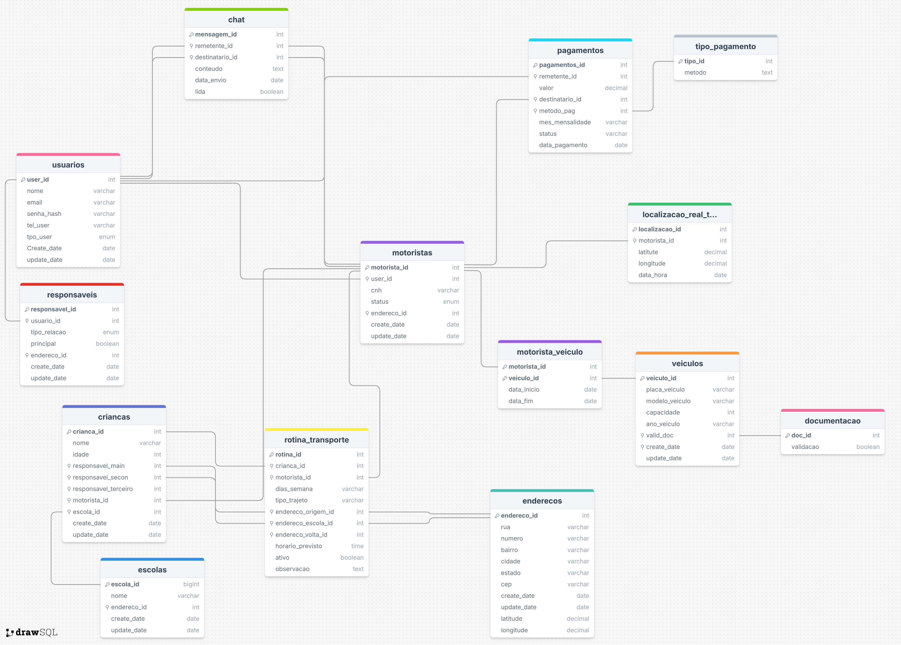

 [`Home`](https://github.com/Scholl-Shuttle) Voltar para Home.

# Banco de dados do VRUMM

> Banco de Dados relacional em **PostgreSQL** para gerenciamento de transporte escolar — incluindo motoristas, veículos, responsáveis, crianças, escolas, rotas e pagamentos.

---

## 📋 Descrição do Projeto

O **VRUMM** é um sistema de gerenciamento que visa facilitar o controle de rotas, motoristas, veículos e pagamentos relacionados ao transporte de alunos.  
O banco de dados foi modelado para garantir **integridade referencial**, **escalabilidade** e **clareza nas relações** entre as entidades principais.

---

## 🧩 Estrutura do Banco de Dados

O banco é composto por **14 tabelas principais**, divididas em módulos:

### 1. Usuários e Acesso
- `usuarios` → informações de login e tipo de usuário (motorista, responsável, admin)
- `responsaveis` → vínculo de responsáveis com as crianças

### 2. Transporte e Operação
- `motoristas` → dados dos condutores
- `veiculos` → informações sobre os veículos
- `motorista_veiculo` → relação N:N entre motoristas e veículos
- `rotina_transporte` → rotinas diárias de transporte (rota, horários, endereços)
- `localizacao_real_tempo` → rastreamento em tempo real do motorista

### 3. Alunos e Escolas
- `criancas` → informações pessoais e responsáveis associados
- `escolas` → cadastro das instituições de ensino

### 4. Pagamentos e Financeiro
- `pagamentos` → controle de mensalidades e status de pagamento
- `tipo_pagamento` → tabela auxiliar (PIX, crédito, débito)

### 5. Suporte e Comunicação
- `chat` → sistema de troca de mensagens entre usuários
- `enderecos` → tabela central de endereços (referenciada em várias entidades)
- `documentacao` → validação dos documentos de veículos

---

## 📐 Modelagem do Banco de dados



---
## 🏗️ Ordem de Criação das Tabelas

Para evitar erros de chave estrangeira, siga esta ordem ao executar os scripts:

1. `usuarios`  
2. `enderecos`  
3. `tipo_pagamento`  
4. `documentacao`  
5. `escolas`  
6. `motoristas`  
7. `veiculos`  
8. `motorista_veiculo`  
9. `responsaveis`  
10. `criancas`  
11. `pagamentos`  
12. `localizacao_real_tempo`  
13. `rotina_transporte`  
14. `chat`

---

## ⚙️ Tecnologias Utilizadas

- **Banco de Dados:** PostgreSQL  
- **Linguagem SQL:** padrão ANSI  
- **Ferramentas de Apoio:** pgAdmin, DBeaver  
- **Modelo Relacional:** baseado em cardinalidade 1:1, 1:N e N:N  
- **Integridade:** todas as relações possuem *Foreign Keys* com `ON DELETE CASCADE` quando aplicável  

---

## 🔁 Exemplo de Trigger (automação)

Exemplo de *trigger* usada para atualizar automaticamente o campo `update_date`:

```sql
(em Breve)
