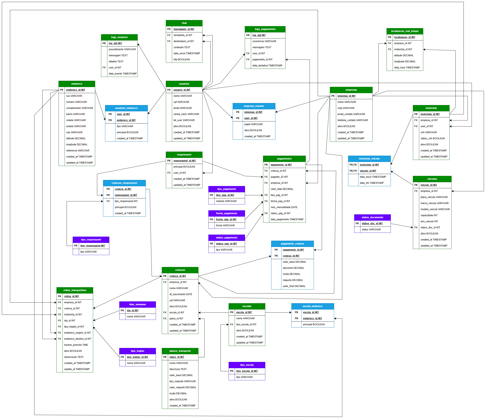

 [`ᐸ`](https://github.com/Scholl-Shuttle) Voltar para Home.

# 🚍 Sistema de Transporte Escolar - Banco de Dados PostgreSQL

> Projeto acadêmico focado na modelagem e implementação do banco de dados de um sistema de transporte escolar.

O sistema foi desenvolvido com foco em automação de mensalidades, segurança dos dados, integridade relacional e regras de negócio no banco.

---
## 🛠️ Tecnologias
- `PostgreSQL`
- `PL/pgSQL`
- `SQL`
- `Procedures`
- `Functions`
- `Triggers`

## 🧩 Estrutura do Banco de Dados
- `PostgreSQL`
- `PL/pgSQL`
- `SQL`
- `Procedures`
- `Functions`
- `Triggers`

## 🗂️ Estrutura do Banco
O banco foi dividido em módulos:

### 1.📍 Cadastros
- `usuarios` → informações de login e tipo de usuário (motorista, responsável, admin)
- `responsaveis` → vínculo de responsáveis com as crianças
- `criancas`
- `empresas`
- `escolas`
- `enderecos`

### 2.🚐 Transporte
- `motoristas` → dados dos condutores
- `veiculos` → informações sobre os veículos
- `motorista_veiculo` → relação N:N entre motoristas e veículos
- `rotina_transporte` → rotinas diárias de transporte (rota, horários, endereços)
- `localizacao_real_tempo` → rastreamento em tempo real do motorista

### 3.💳 Financeiro
- `pagamentos`
- `pagamento_crianca`
- `planos_transporte`
- `status_pagamento`
- `tipo_pagamento`
- `forma_pagamento`

### 4.📝 Auditoria
- `logs_usuarios` → informações pessoais e responsáveis associados
- `logs_pagamentos` → cadastro das instituições de ensino

### 5.📱 Comunicação
- `chat` → sistema de troca de mensagens entre usuários

---

## 📐 Modelagem do Banco de dados

---

## ⚙️ Procedures Implementadas
- `p_gerar_mensalidades_mes(p_mes date)` → Gera automaticamente as mensalidades do mês para todas as crianças ativas.
- `p_cadastrar_usuario()` → Realiza cadastro de usuários com validações.
- `p_vincular_motorista_veiculo()` → Realiza cadastro de usuários com validações.

## 🧠 Functions
- `fn_calcular_valor_final()` 
- `fn_total_faturado_empresa()`
- `fn_total_criancas_ativas()`
---

## 🔒 Triggers de Segurança
- `trg_bloquear_delete_pagamento()`
- `trg_bloquear_edicao_pagamento()`
- `trg_bloquear_deletar_crianca_pendencia()`

---

## 🧪 Casos de Teste
Foram realizados testes para validar:
- `geração de mensalidade`
- `prevenção de duplicidade`
- `atualização automática de status`
- `bloqueio de alterações indevidas`
- `integridade referencial`
- `triggers de segurança`

## 📈 Regras de Negócio
- `mensalidade gerada por criança`
- `pagamento associado ao responsável principal`
- `possibilidade de pagamento individual ou múltiplo`
- `bloqueio de edição após pagamento`
- `bloqueio de exclusão de registros financeiros`
- `mensalidade não duplicada no mesmo mês`

## 🚀 Próximos Passos
- `integração com backend`
- `API REST`
- `integração com PIX/cartão`
- `automação de cobrança`
- `notificações para responsáveis`

---

## 👨‍💻 Autor
# Matheus Cerqueira
Projeto acadêmico desenvolvido para prática de modelagem de banco de dados e regras de negócio em PostgreSQL.
